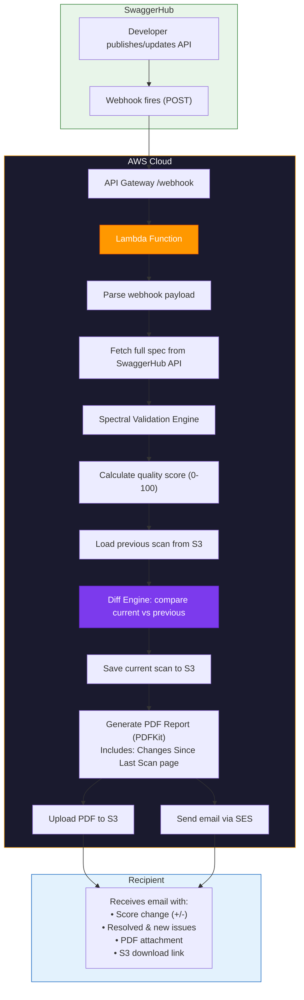

# SwaggerHub Validation Pipeline — Flow Diagram

Paste the Mermaid code below into a **Mermaid macro** in Confluence, or render it at [mermaid.live](https://mermaid.live).

```mermaid
flowchart TD
    subgraph SH["SwaggerHub"]
        A["Developer publishes/updates API"] --> B["Webhook fires (POST)"]
    end

    subgraph AWS["AWS Cloud"]
        C["API Gateway /webhook"] --> D["Lambda Function"]
        D --> E["Parse webhook payload"]
        E --> F["Fetch full spec from SwaggerHub API"]
        F --> G["Spectral Validation Engine"]
        G --> H["Calculate quality score (0-100)"]
        H --> H2["Load previous scan from S3"]
        H2 --> H3["Diff Engine: compare current vs previous"]
        H3 --> H4["Save current scan to S3"]
        H4 --> I["Generate PDF Report (PDFKit)\nIncludes: Changes Since Last Scan page"]
        I --> J["Upload PDF to S3"]
        I --> K["Send email via SES"]
    end

    subgraph R["Recipient"]
        L["Receives email with:\n• Score change (+/-)\n• Resolved & new issues\n• PDF attachment\n• S3 download link"]
    end

    B --> C
    J --> L
    K --> L

    style SH fill:#e8f5e9,stroke:#2e7d32
    style AWS fill:#1a1a2e,stroke:#f59e0b,color:#fff
    style R fill:#e3f2fd,stroke:#1565c0
    style D fill:#ff9800,stroke:#e65100,color:#fff
    style H3 fill:#7c3aed,stroke:#5b21b6,color:#fff
```
